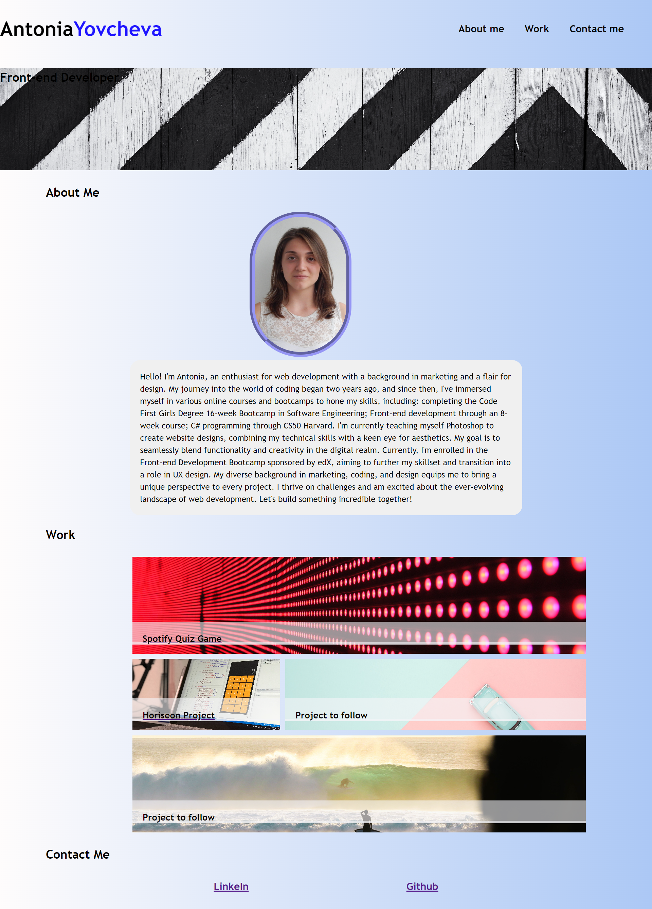

# My first Portfolio

I have built a portfolio page for this week`s assignment  

# Overview
The portfolio page has an 'about me' section, where I have briefly described some of the things I`ve worked on in the past; a 'work' section where I have listed some of the projectes I worked on; and a 'contact' section where I linked my github and linkedIn. 

# Features
I used: flexbox, grid container and media queries.

